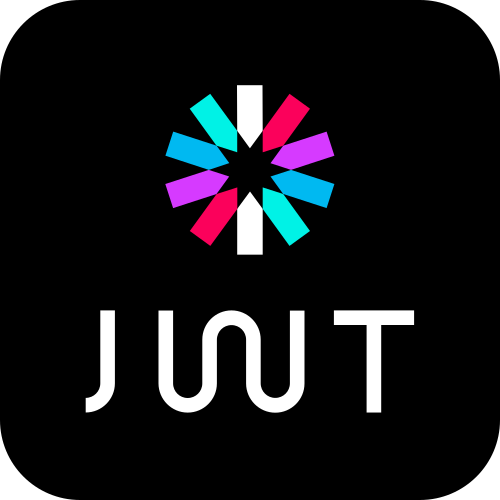
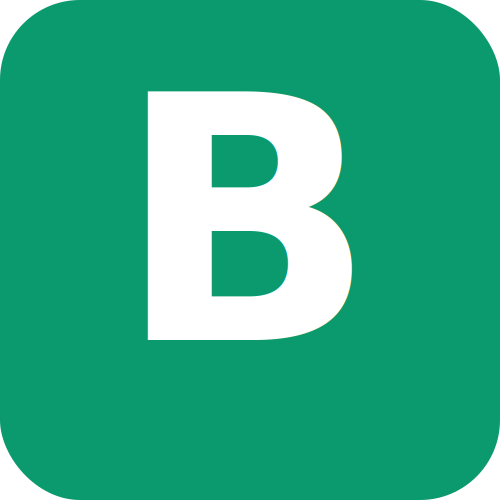

  
  
  
  
  
  
  &nbsp;|&nbsp;
  
  
  
  

---

### 💡 Mes compétences

#### ☆ Environnement

#

#### ☆ Langages

#### ☆ Frameworks & Build tools

#### ☆ CMS

#### ☆ Bases de données

#### ☆ ORM

#### ☆ Auth & Sécurité

  

#### ☆ Librairies & Intégrations

 
  
  

#### ☆ Gestionnaires de paquets

#### ☆ Outils de développement

#### ☆ Tests

#### ☆ Gestionnaire de versions

#### ☆ Ressources & communautés

#### ☆ Terminal / Ligne de commande

#### ☆ Déploiement

#### ☆ Services Cloud

#### ☆ Container

_Initiation à Docker_

#### ☆ Impression 3D

#

#### ☆ Outils Graphiques

#

#### ☆ Outils d'organisation

---

## 📚 Documentation & ressources

- Next.js: https://nextjs.org/
- Prisma: https://www.prisma.io/
- PostgreSQL: https://www.postgresql.org/
- BcryptJs: https://www.npmjs.com/package/bcryptjs
- JWT (JSON Web Tokens): https://jwt.io/
- Vercel: https://vercel.com/
- Neon: https://neon.tech/
- Email.js: https://www.emailjs.com/
- Resend: https://resend.com/
- React Hook Form: https://react-hook-form.com/
- Cloudinary: https://cloudinary.com/
- Vue.js: https://vuejs.org/
- Vite: https://vite.dev/
- Pinia: https://pinia.vuejs.org/
- Vue Router: https://router.vuejs.org/
- Supabase: https://supabase.com/
- Stripe: https://stripe.com/
- Brevo: https://www.brevo.com/
- jsPDF: https://github.com/parallax/jsPDF
- Netlify: https://www.netlify.com/
- Vitest: https://vitest.dev/
- Playwright: https://playwright.dev/

 

  
  

